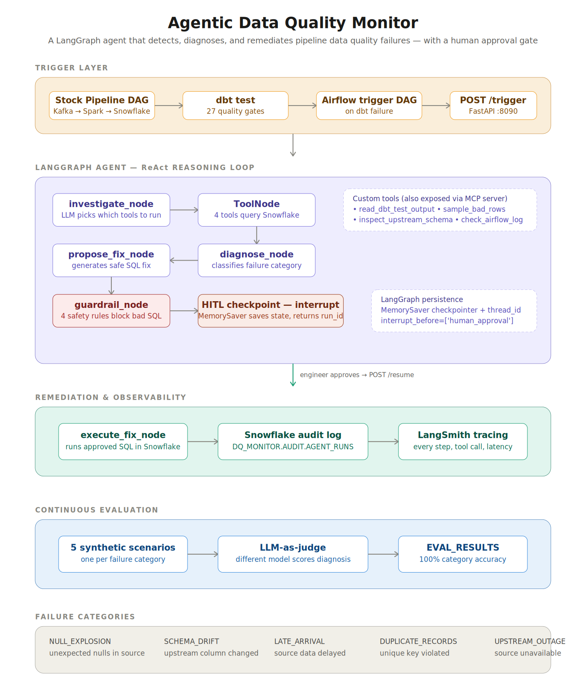

<div align="center">

# Agentic Data Quality Monitor

**A production-grade AI agent that watches your data pipeline, detects quality failures, diagnoses the root cause by inspecting your actual warehouse, proposes a SQL fix — and waits for an engineer to approve before touching anything.**

[](https://github.com/atulpandey02/agentic-dq-monitor/actions)
[](https://python.org)
[](https://langchain-ai.github.io/langgraph/)
[](https://smith.langchain.com)
[](https://groq.com)
[](https://snowflake.com)
[](https://getdbt.com)
[](https://airflow.apache.org)
[](https://fastapi.tiangolo.com)
[](https://modelcontextprotocol.io)

<br/>

**6-node LangGraph agent &nbsp;·&nbsp; 4 custom tools &nbsp;·&nbsp; 4-rule guardrail layer &nbsp;·&nbsp; human-in-the-loop checkpoint &nbsp;·&nbsp; LLM-as-judge evaluation &nbsp;·&nbsp; full Airflow automation**

<br/>

> *Layered on top of the [Stock Market Intelligence Pipeline V2](https://github.com/atulpandey02/stock-market-rag-pipeline) — it monitors that pipeline's real dbt tests and Snowflake tables.*

</div>

---

## The Problem

When a dbt test fails at 2 AM, a data engineer gets paged. They open the warehouse, query the failing table, figure out whether it's a null explosion or a schema change or late-arriving data, write a fix, run it, and re-run the tests. That manual triage takes 30–60 minutes per incident, and it happens over and over for the same handful of failure patterns.

This project replaces that triage loop with an agent. When a dbt test fails, the agent wakes up, investigates the actual warehouse, classifies the failure, proposes a fix, and pauses for a one-click human approval before executing. The engineer reviews a diagnosis instead of starting from a blank query window.

This is **not** a toy. Every tool call hits real infrastructure — real Snowflake tables, real dbt output, real Airflow DAGs.

---

## Table of Contents

- [How It Works](#how-it-works)
- [What Makes This Different](#what-makes-this-different)
- [Architecture](#architecture)
- [The Agent Graph](#the-agent-graph)
- [Failure Categories](#failure-categories)
- [The Guardrail Layer](#the-guardrail-layer)
- [Human-in-the-Loop](#human-in-the-loop)
- [LLMOps — Tracing &amp; Evaluation](#llmops--tracing--evaluation)
- [Custom MCP Server](#custom-mcp-server)
- [Tech Stack](#tech-stack)
- [Project Structure](#project-structure)
- [FastAPI Endpoints](#fastapi-endpoints)
- [Snowflake Audit Schema](#snowflake-audit-schema)
- [Key Engineering Decisions](#key-engineering-decisions)
- [Lessons Learned](#lessons-learned)
- [Getting Started](#getting-started)
- [Resume Bullets](#resume-bullets)

---

## How It Works

A fully automated loop with exactly one human touchpoint — the approval gate:

```
1. Stock pipeline DAG runs   →  Kafka → Spark → Snowflake loads HISTORICAL_STOCK
2. dbt test runs             →  27 quality gates; a null in CLOSE_PRICE fails not_null
3. Airflow trigger DAG fires →  calls POST /trigger on the agent's FastAPI
4. Agent investigates        →  4 tools query real Snowflake, dbt output, schema
5. Agent diagnoses           →  classifies as NULL_EXPLOSION (one of 5 categories)
6. Agent proposes a fix      →  forward-fill SQL using the previous trading day's close
7. Guardrails validate       →  4 rules confirm the SQL is safe to run
8. Agent pauses (HITL)       →  saves state, returns run_id, waits for approval
9. Engineer approves         →  POST /resume with the run_id
10. Fix executes             →  real UPDATE runs in Snowflake, audit log written
11. Pipeline verified        →  Airflow confirms health, marks the DAG complete
```

Steps 1–8 and 10–11 are automatic. Only step 9 — the approval — is human.

---

## What Makes This Different

Most "AI agent" portfolio projects are a chatbot wrapped around an LLM. This one is a **specialist, deterministic, production-grade agent** grounded entirely in real data infrastructure.

**The LLM never invents data.** It only reasons over facts the tools return:

```
Tool: queried Snowflake — found 1 row where CLOSE_PRICE IS NULL (AAPL, 2026-06-11)
Tool: checked INFORMATION_SCHEMA — no schema changes detected
  ↓
LLM: "The evidence shows a null in a column that should never be null,
      and the schema is unchanged — this is NULL_EXPLOSION."
  ↓
LLM proposes: forward-fill from the previous trading day's close (not 0.0 —
              a stock price of zero would be wrong)
```

When the agent proposed its fix, it didn't blindly set the price to `0.0`. It reasoned that a stock price of zero is nonsensical and instead wrote a **forward-fill** — pulling the previous trading day's close. That's domain-aware remediation, not a template.

```sql
UPDATE HISTORICAL_STOCK
SET CLOSE_PRICE = (
    SELECT CLOSE_PRICE FROM HISTORICAL_STOCK
    WHERE SYMBOL = 'AAPL'
    AND DATE = (SELECT MAX(DATE) FROM HISTORICAL_STOCK
                WHERE SYMBOL = 'AAPL' AND DATE < '2026-06-11')
)
WHERE SYMBOL = 'AAPL' AND DATE = '2026-06-11' AND CLOSE_PRICE IS NULL;
```

---

## Architecture

<div align="center">
  
</div>

<br/>

The system has four tiers:

- **Trigger layer** — the stock pipeline DAG finishes loading data, runs dbt tests, and an Airflow DAG calls the agent's FastAPI endpoint when a test fails. No code is shared between Airflow and the agent — they communicate over HTTP, which keeps the Dockerised Airflow free of the agent's dependencies.
- **LangGraph agent** — a 6-node ReAct graph that investigates with tools, diagnoses, proposes a fix, runs guardrails, and pauses at a human-in-the-loop checkpoint using LangGraph's `interrupt_before` and a `MemorySaver` checkpointer.
- **Remediation &amp; observability** — once approved, the fix executes against real Snowflake, every run is logged to an audit table, and LangSmith captures the full reasoning trace.
- **Continuous evaluation** — 5 synthetic scenarios run through an LLM-as-judge that scores diagnosis accuracy, with results persisted to Snowflake.

---

## The Agent Graph

The agent is built as an explicit LangGraph state machine. Each node has one job (Single Responsibility), reads from and writes to a shared `AgentState`, and the graph routes between them with conditional edges.

```
investigate_node  →  ToolNode  →  diagnose_node  →  propose_fix_node
                                                          ↓
        execute_fix_node  ←  human_approval_node  ←  guardrail_node
                                     ⏸ interrupt_before
```

| Node | Responsibility |
|---|---|
| `investigate_node` | LLM reasons about the failure and decides which of the 4 tools to call |
| `ToolNode` | Executes the selected tools against real Snowflake / dbt / Airflow |
| `diagnose_node` | Classifies the failure into one of 5 categories with a constrained output |
| `propose_fix_node` | Generates a single, safe SQL statement (schema injected to prevent column hallucination) |
| `guardrail_node` | Runs 4 safety rules; blocks destructive SQL before a human ever sees it |
| `human_approval_node` | The interrupt point — graph pauses here until the engineer decides |
| `execute_fix_node` | Runs the approved SQL in Snowflake and writes the audit log |

State persistence uses LangGraph's `MemorySaver` checkpointer keyed on a `thread_id` (the run's UUID). When the graph hits the interrupt, it serialises its entire state — the tool findings, the diagnosis, the proposed fix — so the engineer can approve minutes or hours later and the graph resumes from exactly where it paused.

---

## Failure Categories

The agent classifies every failure into one of five categories. Constraining the LLM to a fixed taxonomy (rather than free-form text) makes the output predictable and the downstream routing deterministic.

| Category | Meaning | Typical fix |
|---|---|---|
| `NULL_EXPLOSION` | Unexpected nulls in a column that should never be null | Forward-fill or re-load from source |
| `SCHEMA_DRIFT` | An upstream column was added, removed, or renamed | `NO_SQL_FIX_REQUIRED` — needs a pipeline/dbt change |
| `LATE_ARRIVAL` | Source data is delayed; rows are missing for a date | `NO_SQL_FIX_REQUIRED` — wait or re-trigger ingestion |
| `DUPLICATE_RECORDS` | A unique key was violated | De-duplicate by keeping the latest record |
| `UPSTREAM_OUTAGE` | The source system was unavailable | `NO_SQL_FIX_REQUIRED` — investigate the source |

A key design point: not every failure has a SQL fix. The agent correctly returns `NO_SQL_FIX_REQUIRED` when the right action is a code change or an upstream retry — it doesn't force a band-aid onto a structural problem.

---

## The Guardrail Layer

Before any proposed fix reaches a human, it passes through four independent safety rules. This is the difference between a demo and something you'd run against production.

| Rule | Check |
|---|---|
| **1 — Destructive keywords** | Blocks `DROP`, `TRUNCATE`, `DELETE`, `ALTER`, `GRANT`, `REVOKE`, `CREATE OR REPLACE` |
| **2 — Table reference** | The fix must reference the actual failing table — not some hallucinated table |
| **3 — Single statement** | Exactly one SQL statement; blocks multi-statement injection |
| **4 — LLM safety check** | A second LLM call confirms the statement is structurally safe to run in production |

Rules 1–3 are pure deterministic Python — they need no API key and run in milliseconds, which is why the unit test suite for them runs in CI on every push. Rule 4 is a lazy-initialised LLM call, so the tests run without credentials.

---

## Human-in-the-Loop

The HITL checkpoint is the safety feature that makes autonomous remediation trustworthy. The agent does **all** the thinking automatically; the human makes the final call.

```
Agent investigates, diagnoses, proposes, validates  →  PAUSES
                                                          ↓
                                    returns { run_id, status: "paused" }
                                                          ↓
Engineer reviews the diagnosis + proposed SQL  →  POST /resume { decision: "approved" }
                                                          ↓
                                            Fix executes only now
```

This is implemented with LangGraph's `interrupt_before=['human_approval']`. Critically, the interrupt happens **before** the action — so nothing executes until approval. The same pattern is used in production by Databricks Genie and Snowflake's Cortex tooling: detect and diagnose automatically, gate the write behind a human.

The Airflow trigger DAG mirrors this — its `wait_for_human_approval` task polls the agent's live `/status/{run_id}` endpoint every 30 seconds (up to a 2-hour timeout) and only proceeds to verify pipeline health once the engineer has approved.

---

## LLMOps — Tracing &amp; Evaluation

### LangSmith tracing

Every agent run is fully traced in LangSmith — each reasoning step, every tool call with its inputs and outputs, and end-to-end latency. When a diagnosis looks wrong, the trace shows exactly which tool returned what and how the LLM reasoned over it.

### LLM-as-judge evaluation

A separate evaluation suite runs 5 synthetic failure scenarios — one per category — through the diagnosis and fix-proposal prompts, then scores them with an **LLM-as-judge**.

The judge deliberately uses a **different model** (`llama-3.1-8b-instant`) than the agent (`llama-3.3-70b-versatile`) to reduce self-grading bias — a smaller, differently-behaving model grading the larger one's output rather than a model grading itself.

Each diagnosis is scored on three dimensions:

| Dimension | What it measures |
|---|---|
| `category_correct` | Did the agent classify the failure correctly? |
| `explanation_quality` | How well-reasoned is the explanation? (1–5) |
| `fix_correct` | Is the proposed fix appropriate for the category? |

**Latest results:**

```
Category accuracy:        5/5  (100%)
Avg explanation quality:  4.4 / 5
Fix accuracy:             4/5  (80%)
```

All results are persisted to `DQ_MONITOR.AUDIT.EVAL_RESULTS` for tracking quality over time.

---

## Custom MCP Server

The four data-quality tools aren't just wired into this one agent — they're also exposed through a **custom Model Context Protocol (MCP) server**. MCP is the emerging open standard for letting any agent discover and call tools. By implementing an MCP server, the same `sample_bad_rows` / `inspect_upstream_schema` tools become reusable by any MCP-compatible agent — Claude Desktop, a different LangGraph agent, or a future multi-agent system — without rewriting them.

```
agent/mcp_server.py
  ├── DQToolsHandler          # OOP handler, single responsibility
  ├── list_tools()            # advertises the 4 tools over MCP
  └── call_tool()             # delegates to the handler, returns results
```

The agent itself calls the tools directly (in-process) for performance; the MCP server is the interoperability layer that makes them portable.

---

## Tech Stack

| Layer | Technology | Notes |
|---|---|---|
| Agent framework | LangGraph | 6-node ReAct state graph, `MemorySaver`, `interrupt_before` |
| Agent LLM | Groq Llama-3.3-70b-versatile | Fast, low-cost reasoning |
| Judge LLM | Groq Llama-3.1-8b-instant | Different model → reduces self-grading bias |
| Observability | LangSmith | Full reasoning + tool-call + latency tracing |
| Warehouse | Snowflake | Real `HISTORICAL_STOCK` table + `DQ_MONITOR.AUDIT` schema |
| Transformation | dbt | 27 data quality tests on the monitored pipeline |
| Orchestration | Apache Airflow 2.9.3 | Trigger DAG + HITL wait/poll + health verification |
| API layer | FastAPI + uvicorn | `/trigger`, `/resume`, `/status`, `/runs`, `/health` |
| Interoperability | Custom MCP server | Exposes all 4 tools via Model Context Protocol |
| Evaluation | LLM-as-judge | 5 synthetic scenarios, scored, persisted to Snowflake |
| CI/CD | GitHub Actions | Guardrail unit tests + DAG validation + import checks on every push |

---

## Project Structure

```
agentic-dq-monitor/
├── agent/
│   ├── graph.py                # DataQualityAgent — 6-node LangGraph state graph
│   ├── state.py                # AgentState TypedDict (the agent's working memory)
│   ├── tools.py                # DataQualityTools — 4 tools over real Snowflake
│   ├── guardrails.py           # GuardrailChecker — 4 safety rules
│   ├── snowflake_connector.py  # SnowflakeConnector — fresh connection per call
│   ├── mcp_server.py           # Custom MCP server exposing the 4 tools
│   ├── api.py                  # FastAPI — trigger / resume / status / runs / health
│   └── prompts/
│       ├── v1_diagnose.txt     # Versioned diagnosis prompt (5 categories)
│       └── v1_propose.txt      # Versioned fix prompt (schema-injected)
├── evaluation/
│   ├── scenarios.json          # 5 synthetic failure scenarios
│   ├── judge.py                # DiagnosisJudge — LLM-as-judge scorer
│   └── run_eval.py             # EvaluationRunner — orchestrates + persists results
├── llmops/
│   └── tracing.py              # LangSmith setup and configuration
├── airflow/
│   └── dags/
│       ├── dq_monitor_dag.py   # Manual/ad-hoc trigger DAG
│       └── dbt_trigger.py      # Auto-trigger → wait for approval → verify health
├── tests/
│   └── test_guardrails.py      # 12 unit tests for the guardrail rules
├── docs/
│   └── image/
│       └── architecture_diagram.png
├── .github/
│   └── workflows/
│       └── ci.yml              # Guardrail tests + DAG validation + import checks
├── docker/
│   └── Dockerfile              # Container definition for the agent service
├── .env.example
├── requirements.txt
└── README.md
```

---

## FastAPI Endpoints

All endpoints are documented at `http://localhost:8090/docs` (Swagger UI).

| Method | Endpoint | Description |
|---|---|---|
| `GET` | `/health` | Service health check |
| `POST` | `/trigger` | Start an agent run for a detected failure; returns `run_id` |
| `POST` | `/resume` | Approve or reject a paused run; executes the fix on approval |
| `GET` | `/status/{run_id}` | Live state from the LangGraph checkpointer (used by Airflow polling) |
| `GET` | `/runs/{run_id}` | Audit record for a completed run |

---

## Snowflake Audit Schema

The `DQ_MONITOR.AUDIT` schema is the agent's permanent record. Every run is logged for compliance and debugging.

| Table | Purpose |
|---|---|
| `AGENT_RUNS` | One row per run: failure type, root cause, proposed fix, guardrail result, human decision |
| `FEEDBACK_LOG` | Approve/reject signals captured for future fine-tuning |
| `EVAL_RESULTS` | LLM-as-judge scores per scenario per evaluation run |

---

## Key Engineering Decisions

**Why a specialist agent instead of a general-purpose one?**
A general-purpose agent is flexible but slow, expensive, and prone to hallucination — unacceptable for production data pipelines. This agent does one thing exceptionally well: it has a fixed tool set, a constrained output taxonomy, guardrails, and a human gate. That's what enterprises actually deploy.

**Why does Airflow call the agent over HTTP instead of importing it?**
Airflow runs in Docker. Importing the agent would force the agent's entire dependency tree (LangGraph, Groq, Snowflake connector) into the Airflow image and create path conflicts. An HTTP call to `host.docker.internal:8090` keeps the two systems cleanly decoupled — the standard pattern for triggering external services from Airflow.

**Why a fresh Snowflake connection on every query and execute?**
The HITL pause can last minutes or hours. A connection opened at trigger time would have an expired authentication token by the time the engineer approves. Creating a fresh connection per operation eliminates token-expiry failures entirely.

**Why inject the table schema into the fix-proposal prompt?**
Early on the LLM hallucinated column names (`stock_symbol` instead of `SYMBOL`), and the fix failed in Snowflake. Injecting the exact `HISTORICAL_STOCK` schema into the prompt grounds the LLM in reality and eliminates column-name hallucination.

**Why `interrupt_before` and not `interrupt_after`?**
With `interrupt_after`, the node runs *before* pausing — meaning the fix would already have executed by the time a human looks at it. `interrupt_before` gates the action: the graph pauses *before* the execute node, so nothing is written until approval.

**Why a different model for the judge?**
Using the same model to grade its own output introduces self-grading bias. A smaller, differently-behaving model (`llama-3.1-8b-instant`) grading the larger agent's output is a more honest signal — the industry-standard approach to LLM evaluation.

**Why lazy-initialise the LLM inside the guardrail checker?**
The deterministic rules (1–3) need no API key. Lazy-loading the LLM means the guardrail unit tests run in CI with no credentials, keeping the pipeline green and the tests fast.

---

## Lessons Learned

| Problem | Root Cause | Fix |
|---|---|---|
| Fix failed: `Authentication token has expired` | Connection opened at trigger, used after a long HITL pause | Create a fresh Snowflake connection on every `query()` / `execute()` |
| Guardrail blocked every fix: `table 'string'` | Pydantic passed a placeholder table name | Fallback to the known table name when the value is empty/placeholder |
| Fix failed: `invalid identifier 'STOCK_SYMBOL'` | LLM hallucinated column names | Inject the exact table schema into the propose-fix prompt |
| CI failed: `GROQ_API_KEY must be set` | Guardrail instantiated the LLM at import time | Lazy-initialise the LLM via a `@property` so rule 1–3 tests need no key |
| Airflow polling saw `not_found` | It checked the Snowflake audit table, written only *after* execution | Added a `/status/{run_id}` endpoint that reads live LangGraph checkpointer state |
| `docker cp` of DAGs silently failed | Apostrophe + spaces in the macOS project path broke the path | Drag DAGs into the mounted `dags/` folder via Finder instead |
| dbt failed: `Env var required: SNOWFLAKE_ACCOUNT` | Shell env vars not set in new terminals | Hardcoded credentials in `~/.dbt/profiles.yml` — one place to update on account change |
| Judge crashed: `gemini-1.5-flash not found` / quota 0 | Deprecated model + exhausted free tier | Switched the judge to a second Groq model — free, no quota issues, different from the agent |

---

## Getting Started

> Assumes the [Stock Market Intelligence Pipeline V2](https://github.com/atulpandey02/stock-market-rag-pipeline) is running, since this agent monitors it.

### Prerequisites

| Requirement | Where to get it |
|---|---|
| Snowflake account | [snowflake.com](https://snowflake.com) — free 30-day trial |
| `GROQ_API_KEY` | [console.groq.com](https://console.groq.com) — free tier |
| `LANGSMITH_API_KEY` | [smith.langchain.com](https://smith.langchain.com) — free tier |
| Docker Desktop | [docker.com](https://docker.com) — for the Airflow stack |

### Environment Variables

```bash
# Snowflake
SNOWFLAKE_ACCOUNT=your_account_identifier
SNOWFLAKE_USER=your_username
SNOWFLAKE_PASSWORD=your_password
SNOWFLAKE_WAREHOUSE=COMPUTE_WH
SNOWFLAKE_ROLE=ACCOUNTADMIN

# LLM + observability
GROQ_API_KEY=your_groq_key
LANGSMITH_API_KEY=your_langsmith_key
LANGCHAIN_TRACING_V2=true
LANGCHAIN_PROJECT=agentic-dq-monitor
```

### Run It

```bash
# 1. Clone
git clone https://github.com/atulpandey02/agentic-dq-monitor.git
cd agentic-dq-monitor

# 2. Set up the environment
python -m venv dq_venv
source dq_venv/bin/activate
pip install -r requirements.txt

# 3. Configure
cp .env.example .env
# Fill in your credentials

# 4. Create the Snowflake audit tables
#    Run snowflake/audit_schema.sql in your Snowflake worksheet

# 5. Start the agent API
python -m agent.api
# Swagger UI → http://localhost:8090/docs

# 6. Run the evaluation suite
python -m evaluation.run_eval

# 7. Run the guardrail tests
python -m pytest tests/test_guardrails.py -v
```

### Trigger a run manually

```bash
# Inject a failure into the monitored pipeline (in Snowflake):
#   UPDATE HISTORICAL_STOCK SET CLOSE_PRICE = NULL
#   WHERE SYMBOL = 'AAPL' AND DATE = '2026-06-11';

# Then run dbt test (it fails), and trigger the agent:
curl -X POST http://localhost:8090/trigger \
  -H "Content-Type: application/json" \
  -d '{
    "failure_type": "dbt_test",
    "table_name": "HISTORICAL_STOCK",
    "failure_details": "not_null check on CLOSE_PRICE failed for AAPL on 2026-06-11",
    "pipeline_name": "stock_market_batch_pipeline"
  }'

# Copy the run_id from the response, review the diagnosis, then approve:
curl -X POST http://localhost:8090/resume \
  -H "Content-Type: application/json" \
  -d '{"run_id": "<run_id>", "decision": "approved"}'
```

---

## Resume Bullets

- Built a **LangGraph stateful agent** monitoring Airflow and dbt pipelines — detects data quality failures, identifies root cause by inspecting upstream Snowflake tables, and generates a structured remediation plan replacing manual triage.
- Implemented a **ReAct reasoning loop** with custom tool use — the agent queries dbt test outputs, samples bad rows in Snowflake, and inspects upstream schema changes before proposing a fix; exposed all tools through a custom **MCP server** for cross-agent reuse.
- Built a **human-in-the-loop checkpoint** using LangGraph's interrupt pattern — the agent surfaces its diagnosis and proposed SQL fix for engineer approval before any automated remediation executes.
- Integrated **LangSmith tracing** capturing every reasoning step, tool call, and latency, with **LLM-as-judge evaluation** scoring diagnosis accuracy across synthetic failure scenarios (100% category accuracy, 4.4/5 explanation quality).
- Deployed as an **Airflow-triggered service** that fires on dbt test failures and waits for human approval, with **GitHub Actions CI/CD** covering unit tests and DAG validation on every push.

---

<div align="center">

**Atul Kumar Pandey**

[GitHub](https://github.com/atulpandey02) &nbsp;·&nbsp; [LinkedIn](https://www.linkedin.com/in/atulpandey02/)

Released under the [MIT License](LICENSE)

</div>
